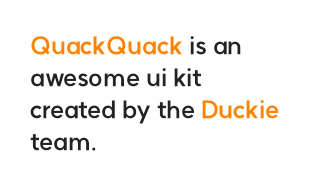
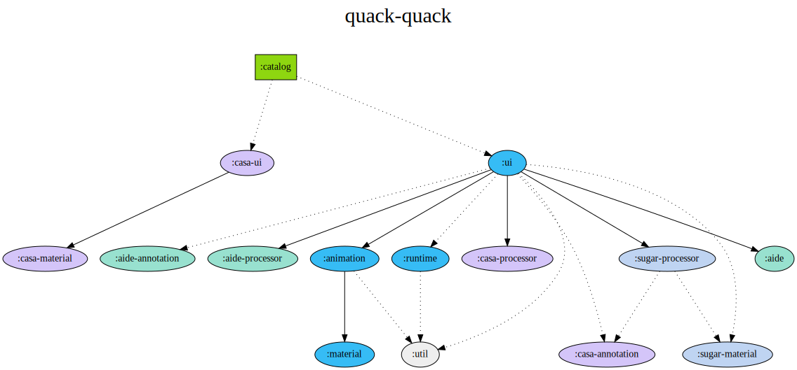

<p align="center">
  
</p>
<h1 align="center">QuackQuack</h1>
<h4 align="center">Highly automated and Modifier-driven Jetpack Compose design system.<br/>It's almost well-tested and adheres to the stability system.</h4>



```kotlin
QuackText(
    modifier = Modifier
        .background(color = Color.White)
        .span(
            texts = listOf("QuackQuack", "Duckie"),
            style = SpanStyle(color = QuackColor.DuckieOrange.value),
        )
        .padding(30.dp),
    text = "QuackQuack is an awesome design system created by the Duckie team.",
    typography = QuackTypography.Body1,
)
```

---

## Introduction

QuackQuack은 꽥꽥이라 발음하며 덕키의 디자인 시스템, 그 이상의 제품입니다. 덕키의 모든 프로덕트에 기본으로 사용되며, 최고의 사용자 경험과 개발자 경험 제공을 목표로 합니다.

꽥꽥은 아래와 같은 이유로 탄생했습니다.

<details>
<summary>디자이너-개발자 간 UI 컴포넌트 용어/이미지 통일</summary>
  <br/>
  디자이너는 컴포넌트를 디자인하면서 붙이는 레이블에 익숙하지만 개발자는 해당 레이블에 익숙하지 않을 수 있습니다. 또한 컴포넌트의 디자인 맥락이 머릿속에 있는데 개발자는 그렇지 않을 수 있습니다. 이러한 상황이 지속되면 디자이너와 개발자 간 소통이 어려워질 수 있습니다. 이를 예방하기 위해 덕키 디자인에 사용되는 컴포넌트를 시스템화하여 모두가 동일한 용어와 이미지를 연상할 수 있게 합니다. 또한 모르는 컴포넌트가 나왔을 때도 쉽게 찾아볼 수 있도록 합니다.
</details>

<details>
<summary>생산성</summary>
  <br/>
  디자인을 시스템화하여 개발하면 다음과 같은 이점을 기대할 수 있습니다.
  <br/><br/>
  • 구현이 완료된 컴포넌트와 그렇지 않은 컴포넌트가 명확하게 구분되어 하나의 컴포넌트를 중복으로 개발하는 일이 없어짐
  <br/>
  • 동일한 컴포넌트인데 개발자의 실수로 세부 디자인에 오차가 생길 일이 없어짐
  <br/>
  • 디자인 시스템 피쳐를 별도로 가져가면 프로덕트 피쳐 개발자가 하나의 주제에만 집중할 수 있음 (디자인에 변경이 생겼을 때 직접 UI 코드베이스를 건들 필요가 없고, 오직 비즈니스 로직에만 집중할 수 있음)
</details>

꽥꽥은 덕키 내부에서 사용할 목적으로 만들어졌기에 외부 프로젝트엔 적합하지 않을 수 있습니다. 다만, Jetpack Compose로 디자인 시스템 개발을 처음 시도하거나 디자인 시스템 도입을 고민하시는 분들께 도움이 됐으면 해서 public으로 진행합니다. 

## Goals

- 접근성, 재사용성 확장 (`이 컴포넌트가 없어요` ❌)
- [오버엔지니어링](https://en.wikipedia.org/wiki/Overengineering), [조기 최적화](http://wiki.c2.com/?PrematureOptimization) ❌

## Project Structure



- : 디자인 컴포넌트 미리 보기 앱
- : 디자인 컴포넌트 미리 보기 구성 요소 자동 생성 모듈
- : 안전한 디자인 시스템 사용을 돕는 안드로이드 린트 모듈
- : 디자인 컴포넌트의 문법 설탕 자동 생성 모듈
- : 디자인 컴포넌트 구현 모듈

각각 기능은 세부 도메인별로 모듈화돼 있습니다.

#### casa

- `annotation`: `CasaModel` 생성을 위한 메타데이터 어노테이션을 제공합니다.
- `material`: casa 구성 클래스를 제공합니다.
- `processor`: 주어진 메타데이터를 기반으로 `CasaModel`을 자동 생성합니다. 
- `ui`: 주어진 casa 구성 클래스를 기반으로 UI를 그립니다.

#### aide

- `annotation`: aide 규칙 생성을 위한 메타데이터 어노테이션을 제공합니다.
- `processor`: 주어진 메타데이터를 기반으로 aide 규칙을 자동 생성합니다.
- `aide`: 주어진 규칙을 기반으로 aide를 구현합니다.

#### sugar

- `material`: 문법 설탕 컴포넌트 생성을 위한 메타데이터를 제공합니다.
- `processor`: 주어진 메타데이터를 기반으로 문법 설탕 컴포넌트를 자동 생성합니다.

#### quackquack

- `runtime`: Compose Runtime을 활용하여 꽥꽥 디자인 컴포넌트가 작동하기 위한 환경을 제공합니다.
- `material`: 디자인 시스템의 기본 리소스를 제공합니다.
- `animation`: 기초적인 애니메이션을 제공합니다.
- `ui`: 디자인 컴포넌트를 구현합니다.

## Tech Stacks

- GitHub Actions
- Android Lint
- Jetpack Compose UI for Android
- Jetpack Compose Runtime
- Kotlin Symbol Processing
- Kotlin Compiler Plugin
- Gradle Plugin

구현 세부사항은 각각 모듈 또는 [ARTICLES](ARTICLES.md) 문서를 참고해 주세요.

## Testing

테스트 가치가 있는 로직은 모두 테스트를 작성하였습니다. 

- Compose Integration Test, Compose Screenshot Test
- Unit Test

Compose Test는 JUnit4에 의존하기에 [JUnit4](https://junit.org/junit4/)를 사용하고, Unit Test는 [Kotest](https://kotest.io/)를 사용합니다.

Compile Test는 [Kotlin Compile Testing](https://github.com/tschuchortdev/kotlin-compile-testing)를 사용하고, Screenshot Test는 [Roborazzi](https://github.com/takahirom/roborazzi)를 사용합니다.

## [WIP] Documentation

dokka + docusaurus + dokka-roborazzi-integration 예정

## [WIP] Preview

[catalog](catalog) 모듈을 빌드하거나 [Google PlayStore](https://play.google.com/store/apps/details?id=team.duckie.quackquack.playground)에서 미리 보기 앱을 설치하실 수 있습니다.

<a href="https://play.google.com/store/apps/details?id=team.duckie.quackquack.playground"></a>

## [WIP] Usage

꽥꽥의 문서는 [여기](https://quackquack.duckie.team/android)서 확인하실 수 있습니다.


## [WIP] Download 

꽥꽥은 MavenCentral 저장소에 배포됩니다.

```groovy
dependencies {
    implementation "team.duckie.quackquack:quackquack-ui:{version}"
}
```

#### Snapshot

개발 중 버전은 [Sonatype의 snapshot 저장소](https://s01.oss.sonatype.org/content/repositories/snapshots/team/duckie/quackquack/)에 배포됩니다.

```groovy
repositories {
    maven {
        url 'https://s01.oss.sonatype.org/content/repositories/snapshots/'
    }
}
```

## Maintainers

- Dev: [지성빈](https://sungb.in)
- Design: [김혜진](https://my.surfit.io/w/417265724)

## Contributions

모든 기여를 환영합니다. 기여하시기 전에 [contribution guide](.github/CONTRIBUTING.md)를 읽어 주세요.

> 기여해 주신 모든 분께 감사합니다. 
> 
> <a href="https://github.com/duckie-team/quack-quack-android/graphs/contributors"></a>

## License

꽥꽥은 [MIT 라이선스](LICENSE)로 관리됩니다.
