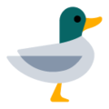

<p align="center">
  
</p>
<h1 align="center">QuackQuack</h1>
<h5 align="center"><a href="https://github.com/sungbinland/duckie">Duckie</a> Design System</h5>
<p align="center">
  <a href="LICENSE"></a>
  <a href="https://developer.android.com/about/versions/marshmallow"></a>
  <a href="https://codecov.io/gh/sungbinland/duckie-quack-quack" > </a>
</p>

---

### Introduce

QuackQuack is a design system to be used in [Duckie](https://github.com/sungbinland/duckie), and consists of a total of 5 modules.

- `ui-components`: QuackQuack Designed composable collection
- `lint-core`: Lint for all codebases
- `lint-quack`: Lint that recommends using QuackQuack UI components
- `lint-compose`: Lint for Jetpack Compose codebase
- `lint-writing`:  Lint for UX Writing (WIP)

Each lint rule will be noted soon (WIP). You can check why QuackQuack was born on the [Duckie Tech Blog](https://medium.com/duckie-stories/%EB%8D%95%ED%82%A4%EC%9D%98-%EB%94%94%EC%9E%90%EC%9D%B8-%EC%8B%9C%EC%8A%A4%ED%85%9C-%EA%BD%A5%EA%BD%A5-%EC%9D%84-%EC%86%8C%EA%B0%9C%ED%95%A9%EB%8B%88%EB%8B%A4-59d962c4bf7) (ko).

### Preview

QuackQuack's design components can be previewed by building the Playground module(or [quack-ui.duckie.team](https://quack-ui.duckie.team/)). It will be released on the Google PlayStore soon.

### Usage

WIP

### Download

**Currently, QuackQuack is still in development and has not been released.** If released later, you can download it as follows.

```kotlin
dependencies {
    implementation(platform("team.duckie.quack:quack-bom:${version}"))

    implementation("team.duckie.quack:quack-ui-components")
    implementation("team.duckie.quack:quack-lint-core")
    implementation("team.duckie.quack:quack-lint-quack")
    implementation("team.duckie.quack:quack-lint-compose")
    implementation("team.duckie.quack:quack-lint-writing")
}
```

### Build

QuackQuack is developed using the latest version of Android Studio Canary. And also requires a build configuration file. Therefore, to build, you need to unzip the `quackuser-secrets.tar` file. You can do it easily with the following command:

```bash
tar xvf quackuser-secrets.tar
```

### Pronounce (for Korean)

`꿱꿱` 이 아닌, `꽥꽥` 이라고 발음합니다.

### Articles (ko)

1. [Introducing Duckie's design system "QuackQuack".](https://blog.duckie.team/%EB%8D%95%ED%82%A4%EC%9D%98-%EB%94%94%EC%9E%90%EC%9D%B8-%EC%8B%9C%EC%8A%A4%ED%85%9C-%EA%BD%A5%EA%BD%A5-%EC%9D%84-%EC%86%8C%EA%B0%9C%ED%95%A9%EB%8B%88%EB%8B%A4-59d962c4bf7)

### Documents

1. [quack-ui.duckie.team](https://quack-ui.duckie.team/): A snapshot image of the developed QuackQuack UI components. It is updated whenever a PR with `UI` and `deploy` labels is opened. To capture a snapshot of a component, use [paparazzi](https://github.com/cashapp/paparazzi).
2. [quack-test.duckie.team](https://quack-test.duckie.team/): Full test coverage HTML report from QuackQuack. It is updated whenever a PR with `test` and `deploy` labels is opened. Test coverage measurements use [Kover](https://github.com/Kotlin/kotlinx-kover).
3. [quack-docs.duckie.team](https://quack-docs.duckie.team/): Full KDoc content from QuackQuack. It is updated whenever a PR with `dokka` and `deploy` labels is opened. HTML generation for deploy in KDoc uses [dokka](https://github.com/Kotlin/dokka). (ko)
4. [documents](/documents): Documents for internal reference of Duckie. Code rules and important notes are noted. (ko)

### Credit

The QuackQuack icon uses a duck emoji from [Tossface](https://toss.im/tossface).
