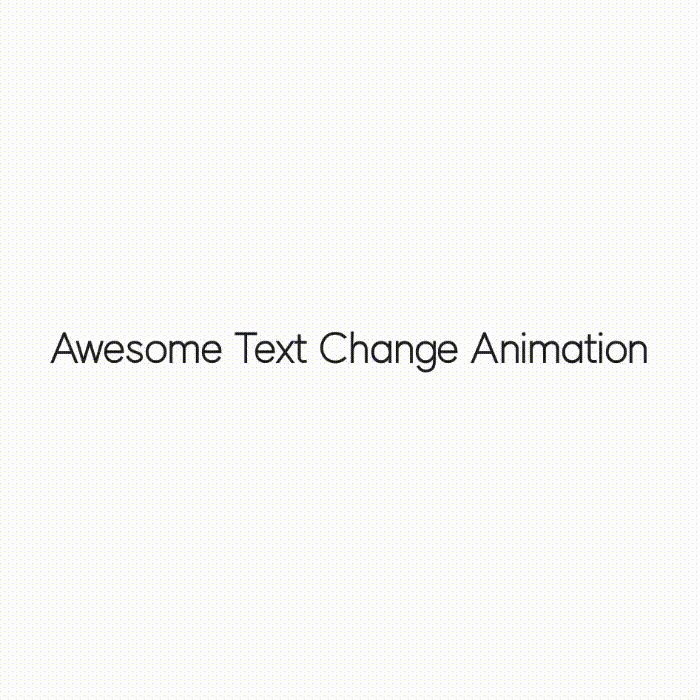

<p align="center">
  
</p>
<h1 align="center">QuackQuack</h1>
<h5 align="center"><a href="https://github.com/duckie-team/duckie-app">Duckie</a> Design System</h5>
<p align="center">
  <a href="LICENSE"></a>
  <a href="https://developer.android.com/about/versions/marshmallow"></a>
  <a href="https://github.com/duckie-team/duckie-app/blob/develop/documents/codestyle.md"></a>
  
</p>

---

# ‼️ WIP ‼️

## Introduction

QuackQuack is a design system and Duckie team's code-style custom lint to be used in [Duckie](https://github.com/duckie-team/duckie-app-mvp). QuackQuack consists of a total of 5 modules.

- `ui-components`: QuackQuack designed composable collection
- `lint-core`: Lint for all codebases
- `lint-quack`: Lint that recommends using QuackQuack UI components instead of Material components
- `lint-compose`: Lint for Jetpack Compose codebase
- `lint-writing`:  Lint for UX Writing

If you are ok in Korean, you can check why QuackQuack was born on the [Duckie tech blog](https://blog.duckie.team/%EB%8D%95%ED%82%A4%EC%9D%98-%EB%94%94%EC%9E%90%EC%9D%B8-%EC%8B%9C%EC%8A%A4%ED%85%9C-%EA%BD%A5%EA%BD%A5-%EC%9D%84-%EC%86%8C%EA%B0%9C%ED%95%A9%EB%8B%88%EB%8B%A4-59d962c4bf7).

## Preview

QuackQuack's design components can be previewed by building the Playground module. If you don't feel like building it yourself, you can download it from the [Google PlayStore](https://play.google.com/store/apps/details?team.duckie.quackquack.playground).

## Caveat

QuackQuack's UI components are intended to be used in Duckie. Therefore, some component designs may not be suitable for non-Duckie services.

## Download

QuackQuack is available in the Maven repository. [BOM](https://maven.apache.org/guides/introduction/introduction-to-dependency-mechanism.html#bill-of-materials-bom-poms) is currently not supported due to [publishing issues](https://github.com/sungbinland/duckie-quack-quack/issues/114). Once the issue is resolved, BOM is published. (we are want for your help!)

> **Warning**: Version 1.x.x was released for internal use for the MVP of Duckie products. Therefore, the stability of some components has not been verified, so if you are interested in this project, we recommend using the 2.x.x version to be released later.

    

```groovy
dependencies {
    implementation "team.duckie.quack:quack-ui-components:{version}"
    implementation "team.duckie.quack:quack-lint-core:{version}"
    implementation "team.duckie.quack:quack-lint-compose:{version}"
    implementation "team.duckie.quack:quack-lint-quack:{version}"
    // implementation "team.duckie.quack:quack-lint-writing:{version}"
}
```

### Snapshot

Snapshots of the development version are available in [Sonatype's `snapshots` repository](https://s01.oss.sonatype.org/content/repositories/snapshots/team/duckie/quack/).

```groovy
repositories {
    // ...
    maven {
        url 'https://s01.oss.sonatype.org/content/repositories/snapshots/'
    }
}
```

## Usage

You can check out QuackQuack's documentation at [opensource.duckie.team/quackquack](https://opensource.duckie.team/quackquack).

## Contribute

> We love your contribution! 

Duckie's team is all Korean, so we're not good at English. So, most of the documentation was done in Korean. If you are familiar with Korean and English, perhaps the easiest and first contribution you can make is the English translation of documents. It will take some time, but it's a worthwhile incredible contribution for all of us, and we love English grammar improvements too, not just translations!

Anyway, *any* contribution is welcome, just make sure you follow the [contribution guide](.github/CONTRIBUTING.md).

## Maintainers

- Project Lead: [Ji Sungbin](https://www.linkedin.com/in/ji-sungbin-4343b7219/)
- Design: [Kim Hyejin](https://www.behance.net/hyejinkim32)
- Documentations & Automations: [Ji Sungbin](https://www.linkedin.com/in/ji-sungbin-4343b7219/)
- UI Components: [Ji Sungbin](https://www.linkedin.com/in/ji-sungbin-4343b7219/), [@EvergreenTree97](https://github.com/EvergreenTree97), [@goddoro](https://github.com/goddoro)
- Lints: [@limsaehyun](https://github.com/limsaehyun), [@riflockle7](https://github.com/riflockle7)

## Tech Stacks (Korean)

꽥꽥은 [androidx](https://github.com/androidx/androidx)(Gradle), [NowInAndroid](https://github.com/android/nowinandroid)(Gradle Convention Plugins), [DroidKaigi](https://github.com/DroidKaigi/conference-app-2022)(Github Actions), [Paparazzi](https://github.com/cashapp/paparazzi)(Github Actions) 를 적극 참고하여 개발됐습니다. 이 중 가치있게 생각되는 것들을 기록합니다.

### Automations

[Github Actions](https://github.com/features/actions) 를 활용하여 CI/CD 를 진행하고 있습니다.

#### [ALL] GRADLE_OPTS

`-Dorg.gradle.daemon=false` 

모든 자동화 워크플로우에서는 [Gradle Daemon](https://docs.gradle.org/current/userguide/gradle_daemon.html) 을 비활성화 합니다. 이는 자동화에서 할당된 Worker 가 이전 Job 과 동일한 Worker 라는 보장을 할 수 없기 때문입니다. 

> **Note**: 모든 자동화 워크플로우에서는 [Gradle Build Action](https://github.com/marketplace/actions/gradle-build-action) 액션을 통해 [Build Caching](https://docs.gradle.org/current/userguide/build_cache.html) 을 하고 있습니다. 따라서 이 조건 하에는 [incremental build](https://docs.gradle.org/current/userguide/performance.html#incremental_build) 를 사용하는 것이 이득을 볼 수 있습니다.

#### Android CI

`master` 브런치로 PR 이 올라올 때마다 실행되며, 빌드 여부와 테스트 커버리지를 검사합니다. 또한 상황에 맞게 UI 컴포넌트들의 스냅샷 이미지를 배포합니다.

- 프로젝트 빌드
  - `./gradlew build` 를 사용하여 프로젝트 빌드, 코드 린트 검사, 테스트 등을 진행합니다.
  - 만약 빌드 실패시 [Gradle Build Scan](https://scans.gradle.com/) 링크를 해당 PR 의 댓글로 첨부합니다.
  - 새로운 코드가 정상적으로 빌드되는지 자동으로 검사하기 위한 과정입니다.
- 테스트 커버리지 검사
  - [Kover](https://github.com/Kotlin/kotlinx-kover) 를 이용하여 테스트 커버리지를 검사합니다.
  - 커버리지 결과를 가지고 리드미 Badge 업데이트와 해당 PR 에 comment 첨부를 진행합니다. 각각 액션으로 [Kotlinx Kover Report](https://github.com/marketplace/actions/kotlinx-kover-report) 와 [Badge Action](https://github.com/marketplace/actions/badge-action) 를 이용합니다.
  - 전체 코드의 테스트 커버리지를 자동으로 추적하기 위한 과정입니다. 덕키는 테스트 커버리지 50% 이상을 목표로 합니다.
- [UI Components 변경일 때] UI 컴포넌트들의 스냅샷 이미지 배포
  - 새로운 UI 컴포넌트를 merge 하기 전에 미리 UI 를 확인해 보기 위해 각각 컴포넌트들의 스냅샷을 캡처하여 [snapshots.duckie.team](https://snapshots.duckie.team/quack) 으로 배포합니다.
  - 스냅샷을 에뮬레이터나 실기기 없이 CI 환경에서 캡처하기 위해 [Paparazzi](https://github.com/cashapp/paparazzi) 를 사용합니다.
  - 매번 UI 를 확인하기 위해 해당 브런치를 다운받고 빌드하는 것이 너무 번거로워 UI 컴포넌트들의 스냅샷 캡처부터 캡처 이미지들 배포까지의 모든 과정을 자동화합니다.
  - 단순 UI 컴포넌트 확인 의외에 다양한 font scale 과 device scale 에서도 의도한대로 디자인이 잘 나오는지 확인할 수 있습니다. 덕키에서는 1배수와 1.5배수의 font scale 과 일반과 테블릿의 device scale 에서 스냅샷 캡처를 진행합니다.

#### Artifact Snapshot Publish

PR 이 `master` 브런치로 merge 될 때마다 실행되며, 대상 아티팩트를 스냅샷 버전으로 배포합니다.

- 스냅샷 배포
  - `Android CI` 작업에 의해 빌드 성공이 검증된 상태이므로 별도의 빌드 확인 과정없이 바로 스냅샷 배포를 진행합니다.
  - 항상 최신 버전의 아티팩트를 사용할 수 있게 스냅샷 버전 배포를 자동화합니다.

#### Artifact Stable Publish

`publish` label 이 붙은 PR 이 `master` 브런치로 merge 되면 실행되며, 이후 성공적으로 빌드됐다면 새로운 버전을 배포합니다.

- 아티팩트 빌드
  - 배포된 아티팩트는 여러 환경에서 실행될 수 있으므로 `MacOS`, `Windows`, `ubuntu` 환경에서 빌드를 각각 진행합니다. 또한 여러 자바 버전도 사용될 수 있으므로 LTS 에 해당되는 [11, 12, 16, 18] 버전을 기준으로 빌드를 진행합니다.
  - 아티팩트가 모든 환경에서 정상적으로 빌드되는지 검사하기 위한 과정입니다.
- 아티팩트 배포
  - [gradle-maven-publish-plugin](https://github.com/vanniktech/gradle-maven-publish-plugin) 을 이용하여 Maven Central 에 배포를 진행합니다. 
  - 만약 배포하려는 아티팩트가 UI 컴포넌트라면 [baseline profile](https://developer.android.com/topic/performance/baselineprofiles/overview) 생성을 진행합니다.
  - 배포가 성공적으로 진행됐다면 GitHub Release 와 Git Tag 를 하는 것으로 배포 작업이 마무리됩니다.
  - 매번 수동 배포는 번거롭고 배포 키를 가진 사람만 배포를 할 수 있다는 문제가 있어서 이를 자동화하기 위한 과정입니다.

> **Note**: 아티팩트의 대상인 Sonatype 은 동시 업로드를 별도의 것으로 보고 각각 두 개의 staging repository 를 생성합니다 [[#]](https://github.com/JakeWharton/dagger-reflect/pull/38). 이를 방지하기 위해 `--no-parallel` 옵션이 필요하지만, 꽥꽥의 경우에는 배포할 모듈을 하나로 특정지어 `publish` 하므로 이 옵션이 필요하지 않습니다. 

#### Playground Release

`release` label 이 붙은 PR 이 `master` 브런치로 merge 되면 실행되며, UI 컴포넌트의 플레이그라운드를 신규 버전으로 릴리스합니다.

- 꽥꽥의 UI 컴포넌트는 빠른 미리보기를 위해 [플레이그라운드](playground)를 제공합니다. 해당 플레이그라운드는 [플레이스토어](https://play.google.com/store/apps/details?team.duckie.quackquack.playground)와 [firebase app distribution](https://firebase.google.com/docs/app-distribution) 으로 배포됩니다. 
- 플레이스토어 배포는 [Upload Android Release to Play Store](https://github.com/marketplace/actions/upload-android-release-to-play-store) 액션을 이용하며, 모두가 다운로드할 수 있게 배포됩니다. firebase app distribution 은 [Firebase App Distribution](https://github.com/marketplace/actions/firebase-app-distribution) 액션을 이용하며, 플레이스토어 심사 과정 없이 덕키팀 내부에서 먼저 확인해보기 위해 덕키팀을 대상으로 배포됩니다.
- 매번 두 가지의 배포를 수동으로 진행하는 것은 번거로운 일이므로 이를 자동화하기 위한 과정입니다.
- firebase app distribution 으로 배포된 플레이그라운드를 가지고 덕키팀 디자이너분이 UI 컴포넌트가 올바르게 나왔는지 확인합니다. 만약 문제가 있다면 수정을 진행하고, 완벽하다면 다음 컴포넌트 개발을 진행합니다.

#### RELEASING NOTE

[RELEASING](RELEASING.md) 문서에서 꽥꽥의 배포 자동화 정책에 대해 자세히 보실 수 있습니다.

### Gradle Convention Plugins

모든 Gradle 에는 [Gradle Convention Plugins](https://docs.gradle.org/current/samples/sample_convention_plugins.html) 을 적용합니다. 반복적인 Gradle 코드를 줄이고, 최소한의 변경으로 공통되는 모든 부분에 변경 사항을 반영하기 위해 사용합니다.

#### Android Application, Android Library

기본적인 `com.android.application` 또는 `com.android.library` 을 구성합니다. 추가로 벤치마크를 위해 `benchmark` variant 도 추가합니다.

#### Android Lint, Android Lint Common

`com.android.lint` 를 구성하고 린트 개발에 필요한 의존성들을 추가합니다.

#### Android Compose, Android Compose UI Test

각각 variant 에 맞게 [Jetpack Compose](https://developer.android.com/jetpack/compose) 사용 환경을 구성합니다. 또한 `Library` variant 에서는 [Compose UI Test](https://developer.android.com/jetpack/compose/testing) 사용 환경도 추가로 구성합니다. 현재 꽥꽥 프로젝트에서는 `ui-components` 모듈만 UI 테스트가 필요하고, 해당 모듈이 `Library` variant 로 구성돼 있습니다.

#### UI Components Benchmark

`com.android.test` 와 [Macrobenchmark](https://developer.android.com/topic/performance/benchmarking/macrobenchmark-overview) 을 구성합니다. `ui-components` 모듈을 대상으로 [baseline profile](https://developer.android.com/topic/performance/baselineprofiles/overview) 을 추출하기 위해 사용됩니다.

#### Jvm Dokka, Jvm Kover, Jvm Library

각각 [Dokka](https://github.com/Kotlin/dokka), [Kover](https://github.com/Kotlin/kotlinx-kover), `java-library` 를 구성합니다.

#### Artifact Publishing

[gradle-maven-publish-plugin](https://github.com/vanniktech/gradle-maven-publish-plugin) 을 구성합니다. 꽥꽥의 Convention Plugins 중에 유일하게 별도 [extensions](build-logic/src/main/kotlin/team/duckie/quackquack/convention/QuackPublishExtension.kt) 을 만들어 진행됩니다.

```kotlin
open class QuackPublishExtension {
    open lateinit var type: QuackArtifactType
    internal val isNotInitialized get() = !::type.isInitialized
    override fun toString() = "artifactName: ${type.artifactId}, " +
            "description: ${type.description}"
}

sealed class QuackArtifactType(
    val artifactId: String,
    val description: String,
) {
    object UiComponents : QuackArtifactType(
        artifactId = "quack-ui-components",
        description = "Duckie's design system core module",
    )

    object LintCore : QuackArtifactType(
        artifactId = "quack-lint-core",
        description = buildLintArtifactDescription(
            target = "Duckie codebase",
        ),
    )

    object LintQuack : QuackArtifactType(
        artifactId = "quack-lint-quack",
        description = buildLintArtifactDescription(
            target = "QuackQuack ui components",
        ),
    )

    object LintCompose : QuackArtifactType(
        artifactId = "quack-lint-compose",
        description = buildLintArtifactDescription(
            target = "Jetpack Compose codebase",
        ),
    )
}
```

꽥꽥에서 배포 가능한 아티팩트들을 미리 타입으로 한정지어 각각 아티팩트에 맞는 groupId 와 artifactId 를 하드코딩합니다. groupId 와 artifactId 를 한 곳에서 관리하여 추후 유지보수하기 편하고, 오탈자 방지를 위해 도입됐습니다.

주어진 아티팩트 타입에 따라 배포 플러그인을 자동으로 구성해주기 때문에 실제 사용에서는 단 3줄로 모든 배포 준비가 끝납니다.

```kotlin
import team.duckie.quackquack.convention.QuackArtifactType

plugins {
    id(ConventionEnum.AndroidQuackPublish)
}

quackArtifactPublish {
    type = QuackArtifactType.UiComponents
}
```

### UI Components

꽥꽥의 UI 컴포넌트들은 다양한 스케일의 UI 를 빠른 속도로 개발하기 위해 모두 [Jetpack Compose](https://developer.android.com/jetpack/compose) 로 개발됐습니다. 

#### 접근성

덕키는 사용자의 접근성을 1순위로 고려하였습니다.

- 넉넉한 터치 영역 ([touch target size](https://support.google.com/accessibility/android/answer/7101858)): 기본적으로 터치 영역이 작은 컴포넌트들은 주어진 터치 영역을 그대로 사용하는게 아닌 컴포넌트 마진의 절반 값을 패딩으로 적용하여 해당 패딩만큼 추가로 터치 영역을 가져가게 설계했습니다.
- 유동적인 컴포넌트 사이즈: 대부분 컴포넌트들의 사이즈를 정적으로 고정시켜두는게 아닌 컴포넌트 내부 패딩으로 사이즈를 결정합니다. 따라서 다양한 font scale 에도 컴포넌트 텍스트의 뭉개짐 없이 완벽한 비율의 컴포넌트를 볼 수 있습니다. 추가로, font scale 에 따라 아이콘의 사이즈도 같이 조정됩니다.
- 아름다운 UI 전환: 모든 컴포넌트들에는 변화 애니메이션이 적용돼 있습니다. 예를 들어 아이콘의 경우라면 틴트 색상 변화 및 아이콘 리소스 변화에 애니메이션이 적용되고, 텍스트의 경우라면 보여지고 있는 텍스트가 변할 때 애니메이션이 적용됩니다.
  |  Quack Component |                            Animation Result                             |
  |:----------------:|:-----------------------------------------------------------------------:|
  |  QuackHeadLine1  |    |
  |    QuackImage    |  |

#### 성능

Jetpack Compose 는 리컴포지션이 매우 많이 발생할 수 있습니다. 따라서 덕키는 접근성 뿐만 아니라 컴포저블의 성능도 최상으로 유지하려 노력하였습니다.

##### @NonRestartableComposable + Skippable + Lambda

꽥꽥은 특정상 베이스가 되는 컴포넌트를 여러번 델리게이트하며 구현됩니다. 

```kotlin
@Composable
@NonRestartableComposable
public fun QuackHeadLine1(
    modifier: Modifier = Modifier,
    text: String,
    color: QuackColor = QuackColor.Black,
    align: TextAlign = TextAlign.Start,
    rippleEnabled: Boolean = false,
    singleLine: Boolean = false,
    onClick: (() -> Unit)? = null,
): Unit = QuackText(
    modifier = modifier.quackClickable(
        rippleEnabled = rippleEnabled,
        onClick = onClick,
    ),
    text = text,
    style = QuackTextStyle.HeadLine1.change(
        color = color,
        textAlign = align,
    ),
    singleLine = singleLine,
)

@Composable
@NonRestartableComposable
public fun QuackLargeButton(
    text: String,
    active: Boolean = true,
    onClick: () -> Unit,
): Unit = QuackBasicButton(
    width = QuackWidth.Fill,
    shape = QuackLargeButtonShape,
    text = text,
    textPadding = QuackLargeButtonTextPadding,
    textStyle = QuackTextStyle.Subtitle.change(
        color = QuackColor.White,
    ),
    backgroundColor = quackButtonStandardBackgroundColorFor(
        enabled = active,
    ),
    onClick = onClick,
    enabled = active,
)
```

위 예시 코드와 같이 컴포저블이 바로 다른 컴포저블을 델리게이트하는 경우에는 [`@NonRestartableComposable`](https://developer.android.com/reference/kotlin/androidx/compose/runtime/NonRestartableComposable)  를 사용하여 컴포저블을 최적화할 수 있습니다. 이 어노테이션을 사용하기 위해선 적어도 다음과 같은 조건을 따라야 합니다.

1. 컴포저블의 인자가 변경되었을 때 해당 컴포저블에 직접적인 영향을 미치지 말아야 합니다. 이를 달성하는 가장 쉬운 조건은 변경될 가능성이 있는 인자를 람다로 제공하는 것입니다. 꽥꽥의 UI 컴포넌트 역시 내부 drawing 을 하는 과정에서 변경될 수 있는 값들은 사소하더라도 다 람다로 제공하여 최대한 이 규직을 지키려고 노력하였습니다. 값을 람다로 제공하게 되면 해당 값이 변경되더라도 `Function<T>` 로 래핑돼 있기 때문에 직접 invoke 되기 전까진 해당 컴포저블에 영향을 미치지 않습니다. 만약 영향을 미치게 된다면 해당 컴포저블이 리컴포지션될 것이고, 이는 NonRestartable 에서 어긋납니다.
2. 컴포저블의 모든 인자가 [안정 상태](https://github.com/duckie-team/duckie-quack-quack-mvp#stability)야 합니다. 이는 해당 컴포저블을 Skippable 상태로 만들기 위함입니다. Skippable 상태가 보장되어야 해당 컴포저블은 NonRestartable, 즉 리컴포지션이 발생하지 않을 수 있다고 가정할 수 있습니다.
3. 컴포저블 내부에 최소한의 로직만 있어야 합니다. 이를 달성하는 가장 쉬운 조건은 위 예시와 같이 컴포저블을 바로 다른 컴포저블로 델리게이트하게 설계하는 것입니다. 로직이 많아지면 어떠한 이유도로 리컴포지션이 발생할 확률이 높아지므로 해당 컴포저블이 NonRestartable 하다고 가정하기 어렵게 됩니다.

컴포저블이 NonRestartable 한 상태가 되면 다음과 같은 이점이 있습니다.

- SlotTable (ComposableTree) 에서 불필요한 공간을 차지하지 않습니다. 기본적으로 모든 컴포저블은 Restartable 한 상태로 간주되어 리컴포지션하는 로직과 함께 SlotTable 에 저장됩니다. 하지만 컴포저블을 NonRestartable 로 만들게 되면 리컴포지션하는 로직 없이 오직 컴포저블 자체에 대한 정보만 SlotTable 에 저장하기 때문에 컴포저블을 사용하기 위한 오버헤드를 약간 줄일 수 있고, 줄어든 공간만큼 (리)컴포지션이 발생할 때마다 SlotTable 을 순회하는 `O(N)` 의 시간이 줄어들게 됩니다.

##### Stability

꽥꽥에서 새로 정의한 UI 상수들은 모두 안정 상태로 만들려 노력하였습니다.

```kotlin
@Immutable
@JvmInline
public value class QuackColor internal constructor(
    public val composeColor: Color,
)

@Immutable
@JvmInline
public value class QuackIcon private constructor(
    @DrawableRes public val drawableId: Int,
)

// TODO: QuackTextStyle 추가 (#302)
```

모든 상수들에 대해 안정 상태를 가져가기 위해 다음과 같은 방안을 적용하였습니다.

1. 코틀린의 `value class` 를 이용하여 원시 타입 혹은 이미 안정 상태인 값을 래핑합니다. `value class` 에 의해 인라인되면서 안정 상태의 값이 그대로 적용되기 때문에 꽥꽥측에서 별도로 처리해 줄 필요가 없기 때문에 가장 효과적이고 강력한 방법입니다.
2. [`@StableMarker`](https://developer.android.com/reference/kotlin/androidx/compose/runtime/StableMarker) 를 직접 사용하고, 도메인적 의미를 강조합니다. 1번이 방법을 부득이하게 사용하지 못하는 경우에는 `QuackTextStyle` 와 같이 직접 StableMarker 를 정의하였습니다. StableMarker 에는 [`@Stable`](https://developer.android.com/reference/kotlin/androidx/compose/runtime/Stable) 과 [`@Immutable`](https://developer.android.com/reference/kotlin/androidx/compose/runtime/Immutable) 로 2가지 종류가 존재합니다. 꽥꽥의 UI 상수는 말 그대로 "상수" 이기 때문에 항상 같은 인스턴스를 반환하여 `@Immutable` 만을 이용하여 Stable 처리를 진행했습니다. ...  TODO: [#302](https://github.com/duckie-team/duckie-quack-quack-mvp/issues/302)

##### Skippable

덕키팀은 컴포저블의 성능을 결정짓는 가장 큰 요소가 바로 Skippable 여부라고 생각합니다. 따라서 모든 컴포저블을 Skippable 상태로 만들기 위해 노력하였으며, 실제로 의도적으로 `Collection<T>` 을 받는 컴포저블 의외에는 모두 Skippable 상태라는 것을 [Compose Compiler Metrics](https://github.com/androidx/androidx/blob/androidx-main/compose/compiler/design/compiler-metrics.md) 을 통해 확인할 수 있습니다.

이 외에 덕키팀에서 고려한 다양한 성능 최적화 방법들은 UI 컴포넌트 개발을 담당해주신 상록님께서 작성하신 [QuackQuack의 최고의 Performance를 위해](https://blog.duckie.team/quack-quack%EC%9D%98-%EC%B5%9C%EA%B3%A0%EC%9D%98-performance%EB%A5%BC-%EC%9C%84%ED%95%B4-ad54421715bc) 아티클에서 확안하실 수 있습니다.

#### 디자인 시스템을 개발하면서 생겼던 고민들

디자인 시스템 개발이 처음이다 보니 개발하는 과정이 마냥 쉽지만은 않았습니다. 대부분 오랜 시간 고민이 필요했었고, 어떤 이유에서 고민이 길어졌고 덕키팀에서 채택한 해결 방법은 무엇이었는지 기록합니다.

##### QuackMainTab

TODO: [#148](https://github.com/duckie-team/duckie-quack-quack-mvp/issues/148)

##### Modifier 노출 여부

Jetpack Compose 에서 [Modifier](https://developer.android.com/reference/kotlin/androidx/compose/ui/Modifier) 는 아주 강력한 존재합니다. 컴포넌트를 아예 재정의할 수도 있으므로 이는 디자인 시스템의 목적이 무시될 수 있음을 의미합니다. 하지만 컴포저블에서 Modifier 사용은 정말 필수적인 상황이므로 덕키팀에서는 이를 해결하기 위해 기본적으로 모든 UI 컴포넌트에서 Modifier 를 막아놓되, 일부 Modifier 가 필수적으로 필요할 것으로 판단되는 컴포넌트에서는 허용되는 범위만큼 Modifier 를 재정의하여 노출하는 것으로 결정하였습니다.

TODO: [#304](https://github.com/duckie-team/duckie-quack-quack-mvp/issues/304)

### Lints

다수 구성된 덕키 안드로이드 팀에서는 각자의 코드 스타일이 다를 수밖에 없습니다. 따라서 코드의 통일성을 높이고,  코드의 구조적 품질을 높이기 위해 여러가지 규칙들을 정의하였습니다. 하지만 우리는 로봇이 아니다 보니 정해진 규칙을 가끔씩 잊거나 잘못된 상황을 발견하지 못할 수 있습니다. 이러한 문제를 효율적으로 해결하기 위해 덕키팀은 Android Studio IDE 환경에서 문제를 식별하기 위해 덕키팀만의 린트를 제작하였습니다. 

#### 덕키팀만의 린트

덕키팀에서 제작한 린트는 4가지로 나뉩니다.

##### Lint Core

일반적인 코드베이스에 사용되는 린트입니다. 코드 가독성과 협업 편리성을 높이기 위한 규칙들로 구성돼 있습니다.

##### Lint Compose

Jetpack Compose 코드베이스에 사용되는 린트입니다. 컴포저블 퍼포먼스 개선과 코드 가독성을 높이기 위한 규칙들도 구성돼 있습니다.

##### Lint Quack

덕키팀에서는 덕키만의 디자인 시스템인 QuackQuack UI Components 를 만들고 사용합니다. 만약 실수로 QuackQuack 을 사용하지 않고 Material 을 사용했다면 이를 QuackQuack 사용으로 바로잡아주기 위한 린트입니다.

##### Lint UX Writing

덕키팀은 고객 만족도가 높은 서비스를 만들기 위해선 UX Writing 이 큰 비중을 차지한다고 생각합니다. 따라서 UX Writing 가이드를 도입하여 정해진 가이드대로 Writing 을 실시합니다. 정해진 가이드대로 Writing 이 제대로 이뤄졌는지를 검사하고, 잘못됐다면 가이드에 맞게 바로잡아주는 린트입니다.

##### Lint UX Writing - UI Overlay

UX Writing 린트는 린트뿐만 아니라 보다 섬세한 체크를 위해 UI Overlay 로도 제공됩니다.

TODO

#### Test

덕키팀의 린트는 100% 테스트를 진행하였습니다. 린트의 경우에는 고려해야 하는 경우와 예외가 매우 광범위하게 나옵니다. 따라서 테스트 작성을 필수적으로 진행하고 있습니다.

린트 테스트의 방식에는 크게 diff 테스트와 count 테스트가 있습니다. 매번 diff 를 작성하는 일은 번거로운 일이므로 덕키팀은 count 테스트만을 사용하여 테스트를 진행하였습니다. count 테스트도 그냥 진행하는 것이 아닌 테스트를 더 쉽게 진행하기 위해 자체 제작한 [`LintTestRule`](https://github.com/duckie-team/duckie-quack-quack-mvp/blob/master/common-lint-test/src/main/kotlin/team/duckie/quackquack/common/lint/test/LintTestRule.kt#L29) 를 활용합니다.

이 외에 덕키팀에서 린트에서 만드는 과정은 개발을 담당한 세현님께서 작성하신 [덕키팀에서 Custom Lint를 만드는 여정](https://blog.duckie.team/team-duckie%EC%97%90%EC%84%9C-custom-lint%EB%A5%BC-%EB%A7%8C%EB%93%9C%EB%8A%94-%EC%97%AC%EC%A0%95-a7ecca72a32f) 아티클에서 확인하실 수 있습니다.

## Pronounce (Korean)

`꿱꿱` 이 아닌, `꽥꽥` 이라고 발음합니다.

## Articles (Korean)

1. [Introducing Duckie's design system "QuackQuack".](https://blog.duckie.team/%EB%8D%95%ED%82%A4%EC%9D%98-%EB%94%94%EC%9E%90%EC%9D%B8-%EC%8B%9C%EC%8A%A4%ED%85%9C-%EA%BD%A5%EA%BD%A5-%EC%9D%84-%EC%86%8C%EA%B0%9C%ED%95%A9%EB%8B%88%EB%8B%A4-59d962c4bf7)

## License

QuackQuack is designed and developed by 2022 Duckie Team, and licensed under MIT. please see the [License](LICENSE) file.


