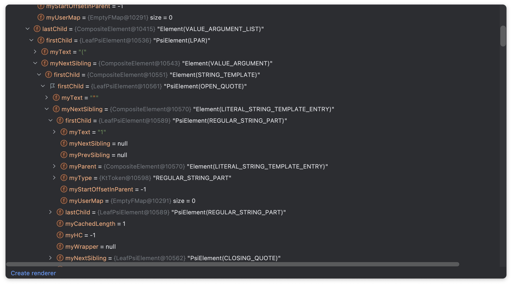

# core-sugar-processor-kotlinc

1. [Overview](#overview)
2. [Why not KSP?](#why-not-ksp)
3. [Ir Visit](#ir-visit)
4. [Code Generate](#code-generate)
5. [Ir Transform](#ir-transform)
6. [Compile Options](#compile-options)
7. [Caveat](#caveat)

---

## Overview

이 모듈은 core 컴포넌트의 sugar syntax를 위한 컴포넌트를 자동 구현합니다. `core-sugar-processor-kotlinc`는 다음과 같은 단계로 진행됩니다.

1. `Ir Visit`
2. `Code Generate`
3. `Ir Transform`


이 중 `Code Generate` 단계는 컴파일 옵션에 따라 생략할 수 있습니다.

이 문서는 `core-sugar-processor-kotlinc`가 작동되는 세부 정책과 이러한 정책이 정해진 이유인 개발 초기의 고민들을 기록합니다.

## Why not KSP?

초기에는 [KSP](https://kotlinlang.org/docs/ksp-overview.html)로 접근하였지만([#487](https://github.com/duckie-team/quack-quack-android/pull/487)), 함수 인자의 default value 파싱이 상당히 어려운 문제가 있었습니다.

KSP는 [PSI](https://plugins.jetbrains.com/docs/intellij/psi.html) 기반으로 작동되고, value parameter의 symbol을 나타내는 `KSValueParameter`의 `defaultValue` 프로퍼티를 사용하면 인자의 기본값을 `KtExpression`으로 조회할 수 있습니다.

문제는 `KtExpression`을 문자열로 나타낼 때 발생합니다.

아래와 같이 sibling이 없고 간단한 PSI tree를 갖는 expression이라면 쉽게 나타낼 수 있지만,

```
true
```


아래와 같이 sibling이 포함된 복잡한 PSI tree를 갖는 expression이라면 파싱의 난이도가 급격히 상승합니다.

```
listOf(1, 2, 3)
```



따라서 default value까지 복사하여 sugar component 코드를 생성하는 건 무리라고 판단하고 default value 지원을 TODO로 남기려 했지만, 컴포즈 환경에서 default value가 없다는 건 개발자에게 너무 치명적인 경험 저하라고 생각하였습니다.

이 문제를 해결하기 위해 KSP보다 코드에 더 low level로 접근할 수 있는 방안을 고민해 보았고, [IR](https://en.wikipedia.org/wiki/Intermediate_representation)이 떠올랐습니다.

코틀린은 IR 접근 API를 public experimental로 공개하고 있으며, Kotlin Compiler Plugin으로 가능합니다. Kotlin Compiler Plugin의 약간의 가설 검증([`29b6fb2`](https://github.com/duckie-team/quack-quack-android/pull/495/commits/29b6fb2913511664ede170a0bed6a3c9a0712774), [`IrValueParameter#defalutValue`](https://slack-chats.kotlinlang.org/t/10002221/hi-is-it-possible-to-get-the-default-value-of-an-irvaluepara#a047d5bf-c73a-48bf-92c8-d3cd7231ace3)) 후에 위와 같은 문제는 비슷한 이유로 해결이 어렵다고 느꼈지만, 해결할 수 있는 다른 방법을 찾아냅니다.

제가 생각한 방법은 이렇습니다.

1. Ir Visitor에서 default value의 Ir을 저장한다.
2. 생성할 코드의 default value는 `Any() as T`와 같은 식으로 컴파일 에러만 나지 않게 지정한다.
3. 생성된 코드의 default value IR을 Ir Transformer를 통해 Ir Visitor에서 저장한 Ir로 교체한다.

위와 같은 방법이 유효함을 로컬에서 증명하였고 `core-sugar-processor`가 `core-sugar-processor-kotlinc`로 바뀌게 됩니다([`0416f53`](https://github.com/duckie-team/quack-quack-android/pull/495/commits/0416f53e2d59add7fc8e0e2772b2fb459b216866)). 

## Ir Visit

`core-sugar-processor-kotlinc`의 첫 번째 동작은 Ir Visit 입니다. 이 단계에서는 다음과 같은 정보를 수집합니다.

- `file`: IR이 제공된 파일
- `referFqn`: IR이 제공된 함수의 fully-qualified name
- `kdoc`: IR이 제공된 함수의 KDoc
- `sugarName`: 생성할 sugar component의 네이밍 규칙. `@SugarName` 값을 가져옵니다.
- `sugarToken`: 생성할 sugar component의 Sugar Token에 해당하는 인자. `@SugarToken`이 달린 인자를 가져옵니다.
- `tokenFqExpressions`: Sugar Token의 expression 모음
- `parameters`: IR이 제공된 함수의 인자 모음. sugar component 생성에 필요한 정보만 수집합니다.

##### `tokenFqExpressions` 예시

```kotlin
@JvmInline
value class Theme(val index: Int) {
    companion object {
        val Default = Theme(1)
        val Dark = Theme(2)
        val Light = Theme(3)
        val System = Theme(4)
    }
}

// ["Theme.Default", "Theme.Dark", "Theme.Light", "Theme.System"]
```

##### `parameters`에서 수집하는 정보

- `name`: 인자명
- `type`: 인자의 타입
- `isToken`: 인자가 Sugar Token인지 여부
- `isComposable`: 인자 타입에 `@Composable` 어노테이션이 있는지 여부
- `imports`: 인자 타입 외에 추가로 import가 필요한 클래스의 fully-qualified name으로 구성된 목록
- `defaultValue`: 인자의 기본값

### Ir 수집 기준

1. `@Composable` 어노테이션이 적용돼 있다.
2. 함수의 접근제한자가 `public`이다.
3. 함수의 반환 타입이 `Unit`이다.
4. 함수의 이름이 "Quack"으로 시작한다.

### `tokenFqExpressions` 조회 기준

1. `@SugarToken` 어노테이션이 달린 인자의 타입에 해당하는 클래스를 조회한다.
2. 조회한 클래스의 companion object 영역을 가져온다.
3. companion object에 정의돼 있는 public property를 조회한다.
4. `"$tokenClassName.$propertyName"` 형식으로 expression을 나타낸다.

## Code Generate

`core-sugar-processor-kotlinc`의 두 번째 동작은 Code Generate 입니다. 이 단계는 건너뛸 수 있습니다. Code Generate는 내부적으로 [kotlinpoet](https://square.github.io/kotlinpoet/)를 사용하며, `poet` 이라는 네이밍을 사용합니다.

poet이 실행되면 다음과 같은 코드를 생성합니다.

1. generated comment & suppress, optin annotation 추가
2. `sugar()` import 추가
3. sugar component에 사용된 import 추가
4. sugar component 함수들 추가

### sugar component 생성 방식

1. Ir Visit 단계에서 수집한 Ir 데이터를 순회한다.
2. `referFqn`을 `@SugarRefer`로 추가한다.
3. `tokenFqExpressions`를 순회하며 주어진 조건에 맞는 sugar component 이름을 계산한다.
4. `referFqn`의 호출로 함수의 본문을 시작하고 `"$parameterName = $parameterName"` 형태로 라인 추가를 진행한다. 만약 sugar token을 입력받는 인자라면 현재 순회중인 `tokenFqExpression` 값을 대입한다.
5. `referFqn` 함수의 인자에서 sugar token을 나타내는 인자를 제외한 나머지 인자들을 그대로 복사하고, default value가 있는 인자라면 `sugar()`를 default value로 하드 코딩한다.
6. `referFqn` 함수의 KDoc을 그대로 복사한다.

## Ir Transform

`core-sugar-processor-kotlinc`의 마지막 동작은 Ir Transform 입니다. poet에서 생성한 `sugar()`를 SugarRefer의 IR로 교체하는 작업을 진행합니다.

SugarRefer의 IR 정보는 Ir Visit 단계에서 조회한 정보로 불러옵니다.

## Compile Options

`core-sugar-processor-kotlinc`는 poet를 조정할 수 있는 2가지 컴파일 옵션을 제공합니다.

- `sugarPath`: Sugar Component가 생성될 위치 [String] \<required>
- `poet`: Code Generate 단계를 활성화할지 여부 [Boolean] \<true>

## Caveat

`core-sugar-processor-kotlinc`에는 몇 가지 단점이 존재합니다.

- Kotlin Compiler Plugin은 아직 experimental 상태입니다. 모든 API가 불안정하므로 예상치 못한 버그가 발생할 수 있습니다.
- Kotlin Compiler Plugin의 문서가 *거의* 존재하지 않아 모두 정상적인 방법으로 구현한 건지 알 방법이 없습니다. 단순히 개발자에게 최고의 경험을 제공하고 싶다는 목표 하나만 가지고 3일간 공부한 내용을 바탕으로 개발되었으므로 안심할 수 없습니다.
- sugar component의 인자로 함수형 타입은 지원되지 않습니다. 함수형 타입엔 [generic type erasure](https://docs.oracle.com/javase/tutorial/java/generics/erasure.html)가 적용되어 컴파일단에서는 `Function`까지만 조회됩니다. 즉, `Function`의 `T` 타입을 유추할 수 없기에 별도 대응이 필요합니다.
- Compiler Plugin 등록 서비스로 deprecated된 방식을 사용합니다. (See [SugarComponentRegistrar.kt](https://github.com/duckie-team/quack-quack-android/blob/2.x.x/core-sugar-processor-kotlinc/src/main/kotlin/SugarComponentRegistrar.kt#L23))
- sugar token의 타입으로 `value class`, `data class`, `class`만 테스트가 진행됐습니다.
