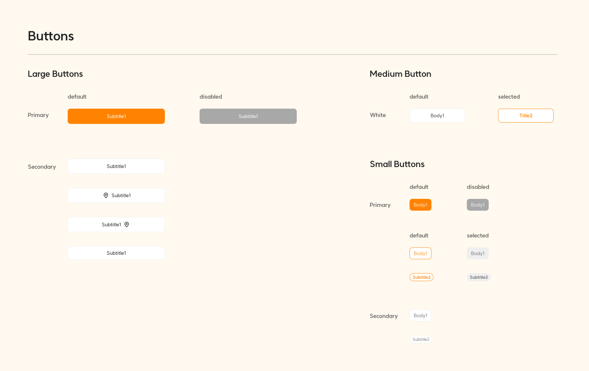
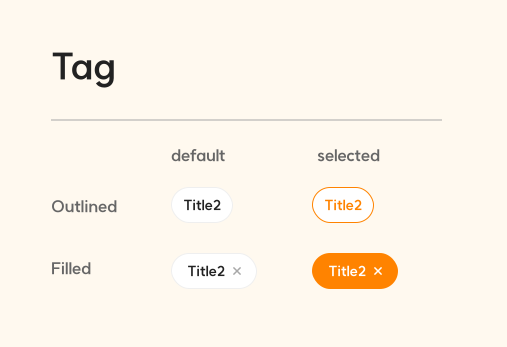

import 'react-tooltip/dist/react-tooltip.css'
import { Tooltip } from 'react-tooltip'

import LargeButtonStyleGuide from './images/large-button-style-guide.svg';

# Thinking in QuackQuack 2

꽥꽥은 **Jetpack Compose를 이용한 [Modifier](https://developer.android.com/reference/kotlin/androidx/compose/ui/Modifier) 기반의 UI Kit** 입니다. 꽥꽥을 제대로 사용하기 위해서는 디자인 토큰(design token)과 데코레이터(decorator)라는 개념 이해가 중요합니다. 이 문서는 해당 개념들을 설명합니다.

:::info

[Why QuackQuack 2](why-adopt.mdx) 문서에서는 이 문서의 기본이 되는 꽥꽥을 두 번째 버전으로 새로 개발하게 된 핵심 사유를 소개합니다. 먼저 [Why QuackQuack 2](why-adopt.mdx) 문서를 읽고 오시면 이 문서를 보다 쉽게 이해하실 수 있습니다.

:::

## 컴포넌트 정의 {#component-spec}

꽥꽥의 모든 UI 컴포넌트는 다음과 같은 규칙으로 정의됩니다.

```kotlin
@Composable
fun ComponentName(
  modifier: Modifier = Modifier,
  token: DesignToken, // 디자인 토큰 인자
  // 이 컴포넌트에서 디자인 토큰 무관으로 공통되는 값들이 추가 인자로 제공됨 
  // 예시) label: String, onClick: () -> Unit, enabled: Boolean, ... 기타 등등
)
```

## 디자인 토큰 {#design-token}

디자인 토큰(design token)은 컴포넌트가 어떤 스타일로 표시돼야 할지를 정의합니다. 덕키의 버튼 스타일 가이드를 봅시다.



버튼의 경우 `Large Buttons`, `Medium Button`, `Small Buttons` 스타일로 나뉘고, `Large Buttons`과 `Small Buttons`은 primary와 secondary variant를 갖고 있습니다. 이들은 각각 `[variant 이름] + 스타일 이름`으로 디자인 토큰이 만들어집니다.

- `Large Buttons # primary` &nbsp;  👉 &nbsp; `QuackButtonStyle.PrimaryLarge`
- `Large Buttons # secondary` &nbsp;  👉 &nbsp; `QuackButtonStyle.SecondaryLarge`
- `Medium Button` &nbsp;  👉 &nbsp; `QuackButtonStyle.Medium`
- `Small Buttons # primary` &nbsp;  👉 &nbsp; `QuackButtonStyle.PrimarySmall`
- `Small Buttons # secondary` &nbsp;  👉 &nbsp; `QuackButtonStyle.SecondarySmall`

이렇게 만들어지는 모든 디자인 토큰은 기본적으로 <a className='immutable'>불변</a>합니다. 하지만 상황에 따라 UI가 유연하게 표시돼야 할 수도 있으므로, 디자인 스펙을 [변경할 수 있는 방법](#design-token-mutation)을 제공합니다.

<Tooltip anchorSelect=".immutable">디자인 가이드라인을 존중하기 위함입니다.</Tooltip>

### 가변 (mutation) {#design-token-mutation}

모든 디자인 토큰은 람다로 디자인 스펙을 변경할 수 있습니다.

```kotlin
val defaultPrimaryLargeButtonStyle = QuackButtonStyle.PrimaryLarge
val extraRadiusPrimaryLargeButtonStyle = QuackButtonStyle.PrimaryLarge {
  radius = 20.dp
}
```

디자인 토큰에서 제공하는 모든 스펙을 람다로 변경할 수 있지만, 변경하기 전에 정말 꼭 필요한 변경인지 충분히 고민해 주세요. 디자인 스펙의 무책임한 변경은 디자인 가이드라인의 목적을 상쇄시킵니다.

## 데코레이터 {#decorator}

데코레이터(decorator)는 컴포넌트의 추가적인 UI 요소를 정의합니다. 덕키의 large 버튼 스타일 가이드를 봅시다.

<LargeButtonStyleGuide width="70%" height="70%"/>

`Large Buttons # primary` 스타일은 아이콘이 포함돼 있지 않지만, `Large Buttons # secondary` 스타일은 아이콘이 포함돼 있습니다. 이런 식으로 하나의 스타일에 공통되는 UI 요소가 아닌, 하나의 스타일의 variant 중 일부에만 포함되는 UI 요소를 데코레이터라고 부릅니다. 즉, `Large Buttons`의 데코레이터는 아이콘이 됩니다.

다른 예시로 덕키의 태그 스타일 가이드를 봅시다.



outlined variant에는 오른쪽 `X` 아이콘이 없지만, filled variant에는 오른쪽 `X` 아이콘이 존재합니다. 즉, 태그의 데코레이터는 `X` 아이콘 표시 여부가 됩니다.

:::tip

태그처럼 단일 스타일에 다중 variant를 갖는다면 디자인 토큰명이 `QuackTagStyle.{variant 이름}`이 됩니다.

- `QuackTagStyle.Outlined`
- `QuackTagStyle.Filled`

:::

컴포넌트에 데코레이터 추가는 `Modifier`를 이용해 가능합니다. 데코레이터 `Modifier`는 `Modifier.{데코레이터 이름}(데코레이터 인자)`와 같은 형식으로 제공됩니다. 

버튼의 데코레이터는 왼쪽 아이콘과 오른쪽 아이콘을 나타냅니다. 따라서 `Modifier.icons(leadingIcon: QuackIcon, trailingIcon: QuackIcon)`으로 데코레이터 `Modifier`가 제공됩니다.

태그의 데코레이터는 오른쪽 `X` 아이콘 표시 여부를 나타냅니다. 따라서 `Modifier.showTrailingXIcon(show: Boolean = true)`으로 데코레이터 `Modifier`가 제공됩니다.

:::info

데코레이터 `Modifier`의 인자 정책

- 태그의 경우 주로 오른쪽 `X` 아이콘을 표시하기 위해 `showTrailingXIcon` 데코레이터를 사용할 것으로 예상됩니다. 개발자의 더 좋은 경험을 위해 `show` 인자의 기본 값이 `true`로 제공됩니다.
- 태그의 경우 일부 환경에서는 filled variant에서도 오른쪽 `X` 아이콘을 숨기고 싶을 수도 있습니다. 따라서 `showTrailingXIcon` 데코레이터에 `show` 인자를 추가하여 자유롭게 show/hide 할 수 있도록 합니다.

:::

### 사용 가능 범위 {#decorator-domain}

모든 데코레이터는 해당 컴포넌트의 도메인으로 사용 가능 범위가 제한됩니다. 예를 들어 `icons` 데코레이터는 버튼의 데코레이터이므로, `Modifier.icons` 데코레이터는 버튼에만 작동되게 설계됩니다. 단, 특별한 경우가 아닌 이상 데코레이터는 variant의 영향을 받지 않습니다. `icons` 데코레이터는 `Large Buttons # primary`에서 파생되었지만, 같은 버튼 도메인을 갖는 `Large Buttons # secondary`, `Medium Button`에서도 사용할 수 있습니다. 특별한 경우로 `Small Buttons`은 variant와 관계 없이 기본적으로 좁은 너비를 가지므로 `icons` 데코레이터 사용이 불가합니다.

### 린팅 (linting) {#decorator-linting}

만약 도메인에 맞지 않는 데코레이터를 사용했을 때는 단순히 무시됩니다. 대신 개발자의 <a className='mistake'>실수</a>를 알려주기 위해 기본적인 린팅이 지원됩니다.

// TODO: 린팅 사진 첨부

<Tooltip anchorSelect=".mistake">도메인에 맞지 않는 데코레이터를 사용했습니다.<br/>원하는 UI를 구현하는 데 혼동을 예방하기 위해 잘못 사용된 데코레이터를 올바른 데코레이터로 교체해야 합니다.</Tooltip>

### Modifier 순서 {#decorator-order}

Jetpack Compose에서 기본으로 제공되는 `Modifier`는 적용 순서가 아주 중요합니다. 하지만 꽥꽥의 데코레이터 `Modifier`는 [꽥꽥 런타임](../runtime.mdx)에 의해 별도로 처리되므로 적용 순서의 영향을 받지 않습니다.