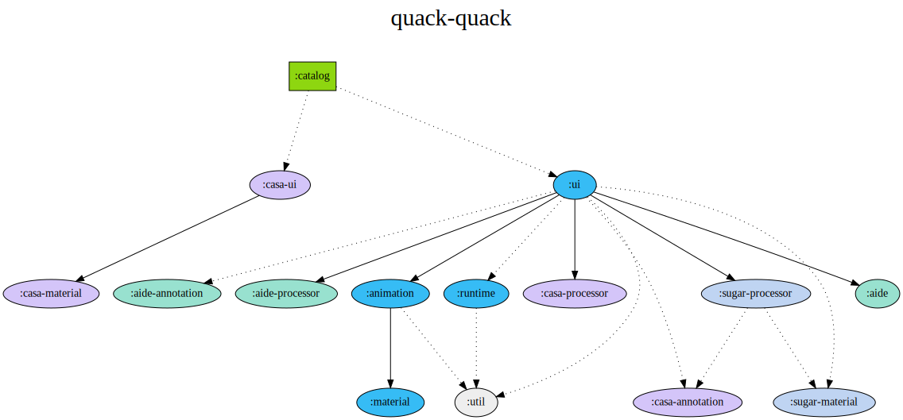
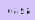
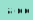

# Modularization

:::caution

이 문서는 오래되었습니다. 최신화가 필요합니다.

:::

... 작성 중

- : 디자인 컴포넌트 미리 보기 앱
- : 디자인 컴포넌트 미리 보기 구성 요소 자동 생성 모듈
- : 안전한 UI Kit 사용을 돕는 안드로이드 린트 모듈
- : 디자인 컴포넌트의 문법 설탕 자동 생성 모듈
- : 디자인 컴포넌트 구현 모듈

각각 기능은 세부 도메인별로 모듈화돼 있습니다.

### casa

- `annotation`: `CasaModel` 생성을 위한 메타데이터 어노테이션을 제공합니다.
- `material`: casa 구성 클래스를 제공합니다.
- `processor`: 주어진 메타데이터를 기반으로 `CasaModel`을 자동 생성합니다.
- `ui`: 주어진 casa 구성 클래스를 기반으로 UI를 그립니다.

### aide

- `annotation`: aide 규칙 생성을 위한 메타데이터 어노테이션을 제공합니다.
- `processor`: 주어진 메타데이터를 기반으로 aide 규칙을 자동 생성합니다.
- `aide`: 주어진 규칙을 기반으로 aide를 구현합니다.

### sugar

- `material`: 문법 설탕 컴포넌트 생성을 위한 메타데이터를 제공합니다.
- `processor`: 주어진 메타데이터를 기반으로 문법 설탕 컴포넌트를 자동 생성합니다.

### quackquack

- `runtime`: Compose Runtime을 활용하여 꽥꽥 디자인 컴포넌트가 작동하기 위한 환경을 제공합니다.
- `material`: UI Kit의 기본 리소스를 제공합니다.
- `animation`: 기초적인 애니메이션을 제공합니다.
- `ui`: 디자인 컴포넌트를 구현합니다.
